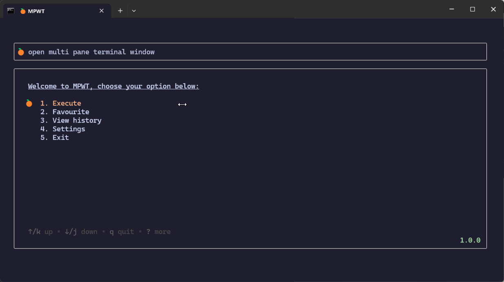
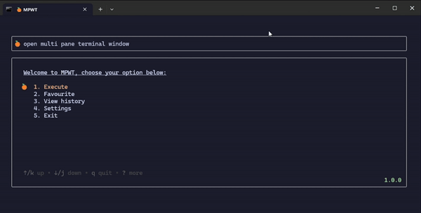
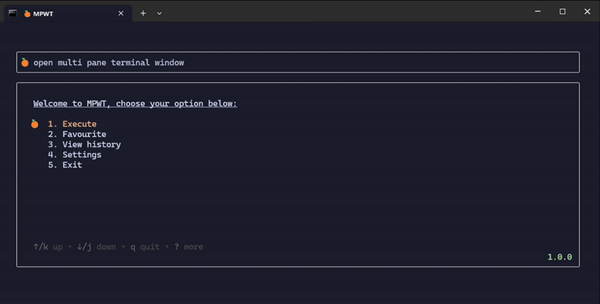
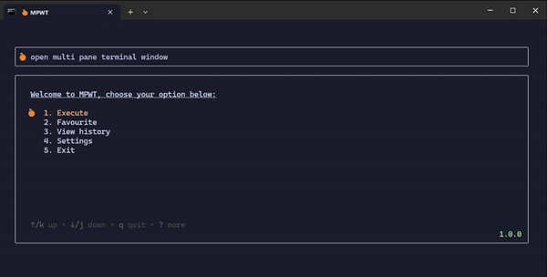
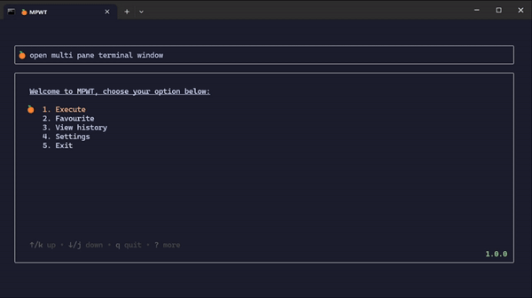

![golang-badge][golang-badge] ![project][project] ![issues][issues] ![last-commit][last-commit]

[golang-badge]: https://img.shields.io/badge/go-1.23-blue
[project]: https://img.shields.io/badge/v1.0.0-red
[issues]: https://img.shields.io/github/issues/songlim327/mpwt
[last-commit]: https://img.shields.io/github/last-commit/songlim327/mpwt

# MPWT 🍊

Welcome to `mpwt` repository! This tool transforms your **Windows Terminal** experience when dealing with multiple panes. This terminal application allows you to execute multiple commands simultaneously by splitting the windows terminal into distinct panes for each command. Whether you're a developer, system administrator, or simply a command-line enthusiast, this tool is designed to enhance your productivity and streamline your workflows in Windows.

## Features 🌟

- **Dynamic Terminal Splitting**: Automatically splits your windows terminal based on the number of commands specified
- **Multi Commands Execution**: Enter multiple commands at once and watch them run in distinct pane
- **Re-run Commands from History**: Save the hassle by quickly execute any repeated command from your history
- **Create Favorites**: Save frequently used commands as favorites for quick access and effortlessly execute them in the future without needing to type the same command again

## Showcase 🦄



## Setup 📐

### winget

```powershell
winget install --id songlim327.mpwt
```

### Manual

Alternatively, download [prebuild binaries](https://github.com/songlim327/mpwt/releases), double click to execute it.

## Configuration ⚙️

You can customize various settings by editing them in the settings.

|Field|Description|
|:---|:----|
|**maximize**|Controls whether the temrinal maximizes when opened - works only if `open_in_new_tab` is set to false (default: `false`)|
|**direction**|Determine the orientation for the terminal pane arrangement: horizontal/vertical (default: `horizontal`)|
|**columns**| Defines the number of fixed columns in the terminal layout; rows are auto-calculated (default: `2`)|
|**open_in_new_tab**|Specifies if the terminal should open in a new tab or a new window (default: `true`)|

## Usage 📙

### Execute



### History



### Favourite



### Settings


